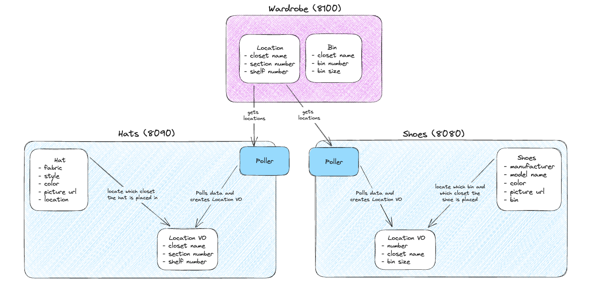

# Wardrobify
Wardrobify is a web-based application that allows people with large and many closets to organize their hats and shoes.

A starter project to practice RESTful API creation in microservices and a React front-end to interact with them.

#### Team:

* Emily Yim - Hats
* Brian La - Shoes

## Design

## Shoes microservice

The Shoes microservice will poll data from the wardrobe_api Bin Model. It will then use that data to create a BinVO model to allow us to locate where the shoe is placed in which bin and which closet.
##### Models:
* Shoes: manufacturer, model name, color, picture url, and bin (retrieved from BinVO)
* BinVO: number, closet name, bin size

## Hats microservice

For backend, created a Hat model and LocationVO model with relevant attributes (i.e. fabric, style, color, picture, location for Hat model). Implemented a poller to pull Location data from the Wardrobe API, which is then integrated with the Hats microservice LocationVO model. Created React components for frontend to allow user to add a hat, delete a hat, and view all hats that are stored in the database.
##### Models:
* Hat: fabric, style, color, picture url, and location (retrieved from LocationVO)
* LocationVO: closet name, section number, and shelf number

## Getting Started
* fork repo
* clone repo
* set up insomnia to make requests to wardrobe API (locations and bins)
    * create, get all, get one, delete one, update one
